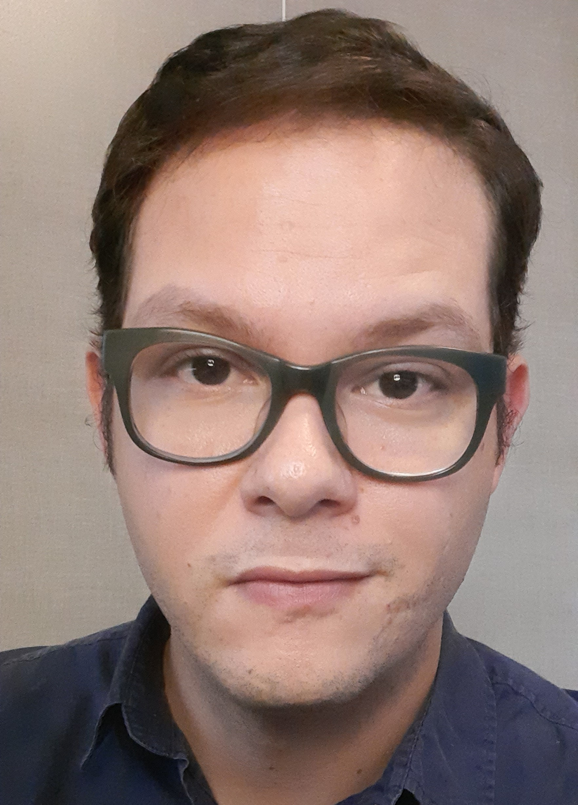

<h1 align="center"> Francisco Douglas Quirino</h1>

  

## Introdução

Olá! Me chamo Francisco, tenho 36 anos e iniciei minha jornada na área de tecnologia em 2021, quando comecei o curso de Análise e Desenvolvimento de Sistemas na FATEC São José dos Campos. Antes disso eu não tinha experiência na área mas sempre tive afinidade com computadores e ciências exatas e desde então venho me dedicando com entusiasmo ao aprendizado e ao desenvolvimento de projetos que unem teoria e prática.

Minha trajetória profissional começou em 2008 e, ao longo dos anos, atuei em diferentes setores como hotelaria, comércio e produção de eventos. Essas experiências me proporcionaram uma base sólida em atendimento ao cliente, organização de rotinas administrativas e trabalho em equipe – habilidades que sigo aplicando e adaptando ao universo da tecnologia.

Este repositório reúne os projetos integradores que desenvolvi na graduação (APIs - Aprendizagem por Projetos Integrados), construídos com o objetivo de consolidar o conhecimento adquirido e demonstrar minha evolução na área. No momento, estou em busca de oportunidades de trabalho na área de tecnologia, onde eu possa continuar aprendendo, contribuindo e crescendo profissionalmente

## Contato

* [Github](https://github.com/ciscoquirino)
* [LinkedIn](https://www.linkedin.com/in/francisco-quirino/)
* [E-mail](mailto:quirino1988@gmail.com)

## Principais Conhecimentos

|                                                         Tecnologias                                                          | Básico | Intermediário | Avançado |
| :--------------------------------------------------------------------------------------------------------------------------: | :----: | :-----------: | :------: |
|                     |        |       ✔️       |          |
|                        |    ✔️    |              |          |
|  |        |       ✔️       |          |
|      |      |       ✔️        |          |
|                  |      |       ✔️        |          |
|                 |    ✔️    |             |          |
|   |    ✔️    |              |          |
|                        |       |        ✔️       |          |
|                        |       |       ✔️        |          |
|          |       |        ✔️       |          |
|               |   ✔️    |               |          |
|                        |       |       ✔️        |          |

## Meus Projetos

### Primeiro Semestre (2021-1)

O projeto surgiu para resolver problemas enfrentados pelo CECOI Vó Maria Félix relacionados à baixa visibilidade e à dificuldade de comunicação com seus públicos-alvo, como participantes, voluntários e doadores. A ausência de um website institucional dificultava a divulgação de projetos, o contato com apoiadores e a transparência sobre as atividades realizadas, limitando o alcance e o impacto da instituição.

Para solucionar essas questões, desenvolvemos um website institucional para o CECOI Vó Maria Félix (ONG destinada para crianças), com intuito de melhorar a visibilidade e facilitar o contato entre a instituição e seus participantes, voluntários e pessoas/parceiros doadores.

O parceiro neste projeto foi a Faculdade de Tecnologia de São José dos Campos - Prof. Jessen Vidal, onde o Prof. Antonio Egydio fez o papel de cliente.

* [Link para o repositório do API 1º semestre](https://github.com/ciscoquirino/API-Fatec-Site-Institucional)

### Tecnologias Utilizadas

#### Reuniões
   
  - WhatsApp - Comunicação rápida com os integrantes, avisos;
  - Microsoft Teams - Realização de reuniões com o cliente, acesso à documentação dos requisitos e compartilhamento de arquivos do grupo.
 
#### Banco de Dados
 
   - MySQL - Armazenamento e manipulação de dados.

#### Back-end  
  
  - PHP - Scripts para comunicação com o servidor.

#### Front-end 
 
  - HTML5 - Estrututa e definição do layout do site;
  - CSS3 - Estilização do site.

#### Outros
 
  - Github - Repositório do projeto para controle de versão;
  - Visual Studio Code - Ambiente de Desenvolvimento Integrado do grupo;
  - Canva - Edição de componentes da documentação, imagens e apresentações;
  - Google Sites - Criação do protótipo navegável;

### Contribuições Pessoais

Neste projeto atuei como Scrum Master, facilitando a implementação de metodologias ágeis e também como desenvolvedor full-stack, criei os protótipos navegáveis do site e desenvolvi o front-end (HTML, CSS) e back-end(PHP, MySQL) das páginas de cadastro de usuário e de voluntários.

### Hard Skills

  - HTML5 - Uso com autonomia
  - CSS3 - Uso com consulta
  - PHP - Uso com consulta
  - MySQL - Uso com autonomia

### Soft Skills

  - Autonomia - Neste projeto foi preciso autonomia para aprender tecnologias novas, como eu nunca tive contato com programação antes, busquei fontes alternativas como documentação e fóruns online, além do conteúdo aprendido nas aulas. 
  
  - Flexibilidade - Tive que ser flexível pois ao longo do projeto 3 integrantes deixaram a equipe, então em diversos momentos eu precisei reorganizar as tarefas e ajudar os desenvolvedores a atingir a solução proposta.
  
  - Colaboração - As tecnologias eram novas para todos da equipe, então cada descoberta e aprendizado eu compartilhava com o grupo e ajudei colegas que tiveram mais dificuldades.

